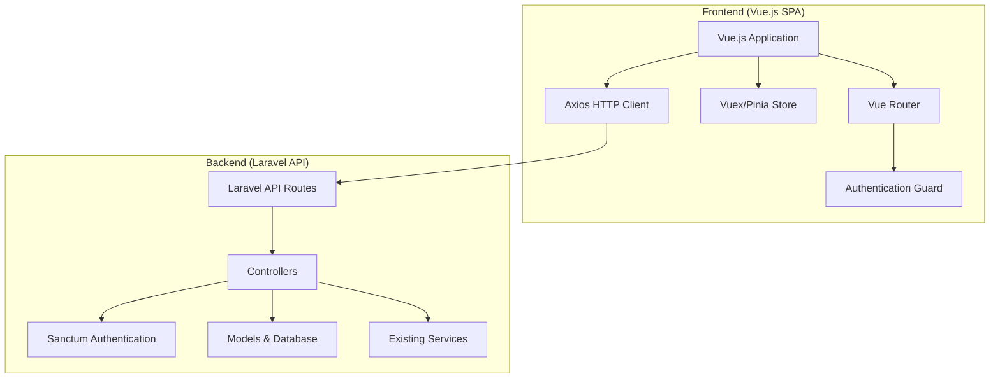
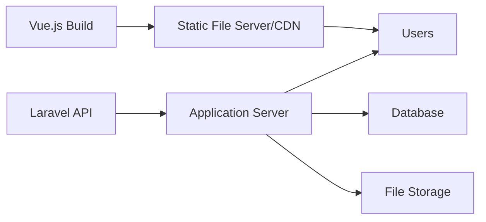

# Design Document

## Overview

This design outlines the migration of the existing Laravel Blade-based loan management system to a Vue.js single-page application (SPA) frontend while maintaining the Laravel backend as a RESTful API. The architecture will follow a decoupled approach where Vue.js handles all UI rendering and user interactions, while Laravel serves as the API backend with authentication via Laravel Sanctum.

## Architecture

### High-Level Architecture



### Technology Stack

**Frontend:**
- Vue.js 3 with Composition API
- Vue Router 4 for client-side routing
- Pinia for state management
- Axios for HTTP requests
- Vite for build tooling
- Tailwind CSS for styling (to match existing design)
- Vue 3 Teleport for modals and overlays

**Backend:**
- Laravel 10+ (existing)
- Laravel Sanctum for API authentication
- Existing database structure (unchanged)
- CORS configuration for cross-origin requests

## Components and Interfaces

### Vue.js Component Structure

```
src/
├── components/
│   ├── common/
│   │   ├── AppLayout.vue
│   │   ├── LoadingSpinner.vue
│   │   ├── ErrorAlert.vue
│   │   └── ConfirmDialog.vue
│   ├── auth/
│   │   ├── LoginForm.vue
│   │   ├── RegisterForm.vue
│   │   └── ForgotPasswordForm.vue
│   ├── dashboard/
│   │   ├── DashboardLayout.vue
│   │   ├── StatsCards.vue
│   │   └── QuickActions.vue
│   ├── loans/
│   │   ├── LoanApplicationForm.vue
│   │   ├── LoansList.vue
│   │   ├── LoanDetails.vue
│   │   └── LoanStatusBadge.vue
│   └── forms/
│       ├── FormInput.vue
│       ├── FormSelect.vue
│       └── FileUpload.vue
├── views/
│   ├── auth/
│   │   ├── Login.vue
│   │   ├── Register.vue
│   │   └── ForgotPassword.vue
│   ├── dashboard/
│   │   ├── Dashboard.vue
│   │   ├── LoanRequests.vue
│   │   └── UserManagement.vue
│   └── loans/
│       ├── NewLoan.vue
│       ├── LoanHistory.vue
│       └── LoanDetails.vue
├── stores/
│   ├── auth.js
│   ├── loans.js
│   └── users.js
├── services/
│   ├── api.js
│   ├── auth.js
│   └── loans.js
└── router/
    └── index.js
```

### API Interface Design

**Authentication Endpoints:**
```
POST /api/auth/login
POST /api/auth/logout
POST /api/auth/register
POST /api/auth/forgot-password
POST /api/auth/reset-password
GET  /api/auth/user
```

**Loan Management Endpoints:**
```
GET    /api/loans
POST   /api/loans
GET    /api/loans/{id}
PUT    /api/loans/{id}
DELETE /api/loans/{id}
POST   /api/loans/{id}/approve
POST   /api/loans/{id}/reject
```

**User Management Endpoints:**
```
GET    /api/users
POST   /api/users
GET    /api/users/{id}
PUT    /api/users/{id}
DELETE /api/users/{id}
```

### State Management Structure

**Auth Store (Pinia):**
```javascript
export const useAuthStore = defineStore('auth', {
  state: () => ({
    user: null,
    token: localStorage.getItem('token'),
    isAuthenticated: false,
    permissions: []
  }),
  actions: {
    async login(credentials),
    async logout(),
    async fetchUser(),
    checkPermission(permission)
  }
})
```

**Loans Store (Pinia):**
```javascript
export const useLoansStore = defineStore('loans', {
  state: () => ({
    loans: [],
    currentLoan: null,
    loading: false,
    filters: {}
  }),
  actions: {
    async fetchLoans(),
    async createLoan(data),
    async updateLoan(id, data),
    async deleteLoan(id)
  }
})
```

## Data Models

### Frontend Data Models

**User Model:**
```typescript
interface User {
  id: number
  name: string
  email: string
  role: string
  permissions: string[]
  profile_picture?: string
  created_at: string
  updated_at: string
}
```

**Loan Model:**
```typescript
interface Loan {
  id: number
  user_id: number
  amount: number
  interest_rate: number
  term_months: number
  status: 'pending' | 'approved' | 'rejected' | 'disbursed' | 'closed'
  application_date: string
  approval_date?: string
  disbursement_date?: string
  documents: Document[]
  repayments: Repayment[]
}
```

**API Response Model:**
```typescript
interface ApiResponse<T> {
  data: T
  message?: string
  errors?: Record<string, string[]>
  meta?: {
    current_page: number
    last_page: number
    per_page: number
    total: number
  }
}
```

### Backend API Response Format

**Success Response:**
```json
{
  "success": true,
  "data": {},
  "message": "Operation completed successfully",
  "meta": {
    "timestamp": "2024-01-01T00:00:00Z"
  }
}
```

**Error Response:**
```json
{
  "success": false,
  "message": "Validation failed",
  "errors": {
    "email": ["The email field is required"],
    "password": ["The password must be at least 8 characters"]
  }
}
```

## Error Handling

### Frontend Error Handling Strategy

1. **HTTP Interceptors:** Axios interceptors to handle common errors (401, 403, 500)
2. **Global Error Handler:** Vue global error handler for uncaught exceptions
3. **User-Friendly Messages:** Convert technical errors to user-friendly messages
4. **Retry Logic:** Automatic retry for network failures
5. **Offline Detection:** Handle offline scenarios gracefully

### Backend Error Handling

1. **Exception Handler:** Laravel exception handler for API responses
2. **Validation Errors:** Standardized validation error responses
3. **Authentication Errors:** Proper 401/403 responses with clear messages
4. **Rate Limiting:** API rate limiting with appropriate error responses

## Testing Strategy

### Frontend Testing

1. **Unit Tests:** Vue Test Utils for component testing
2. **Integration Tests:** API integration tests with mock responses
3. **E2E Tests:** Cypress for end-to-end user workflows
4. **Visual Regression:** Screenshot testing for UI consistency

### Backend Testing

1. **API Tests:** Laravel Feature tests for all API endpoints
2. **Authentication Tests:** Sanctum authentication flow testing
3. **Database Tests:** Model and relationship testing
4. **Performance Tests:** API response time and load testing

## Migration Strategy

### Phase 1: Foundation Setup
- Set up Vue.js project structure
- Configure Laravel API routes
- Implement Sanctum authentication
- Create base components and layouts

### Phase 2: Authentication Migration
- Migrate login/register forms
- Implement token-based authentication
- Set up route guards and permissions
- Test authentication flows

### Phase 3: Core Features Migration
- Migrate dashboard components
- Implement loan application forms
- Create user management interfaces
- Migrate reporting features

### Phase 4: Advanced Features
- Implement real-time notifications
- Add file upload functionality
- Migrate complex forms and wizards
- Performance optimization

### Phase 5: Testing and Deployment
- Comprehensive testing
- Performance optimization
- SEO considerations (if needed)
- Production deployment

## Security Considerations

1. **CSRF Protection:** Laravel Sanctum handles CSRF for SPA
2. **XSS Prevention:** Vue.js automatic escaping and CSP headers
3. **Token Security:** Secure token storage and automatic refresh
4. **API Rate Limiting:** Prevent abuse with rate limiting
5. **Input Validation:** Client and server-side validation
6. **CORS Configuration:** Proper CORS setup for API access

## Performance Optimization

1. **Code Splitting:** Vue Router lazy loading for routes
2. **Component Lazy Loading:** Dynamic imports for large components
3. **API Caching:** Intelligent caching of API responses
4. **Image Optimization:** Lazy loading and responsive images
5. **Bundle Optimization:** Tree shaking and minification
6. **CDN Integration:** Static asset delivery via CDN

## Deployment Architecture



The Vue.js application will be built as static files and served from a CDN or static file server, while the Laravel API will run on a separate application server. This allows for independent scaling and deployment of frontend and backend components.
